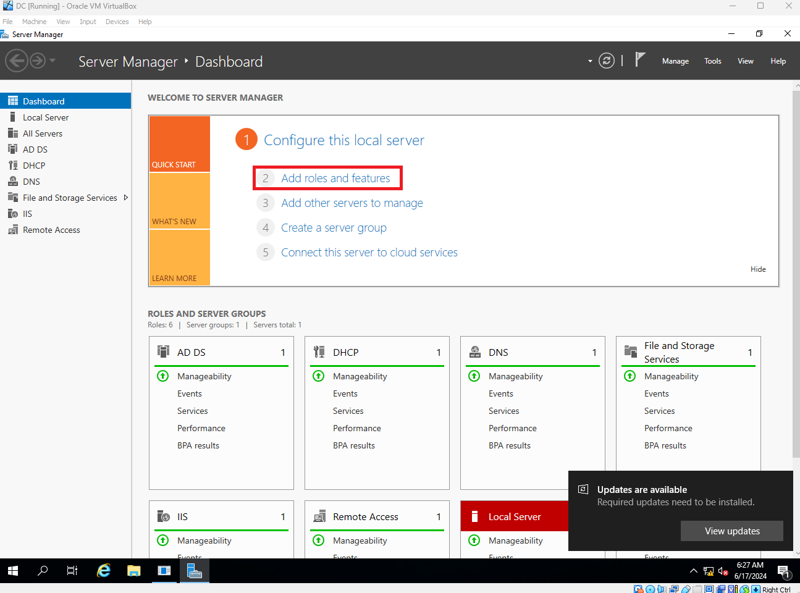
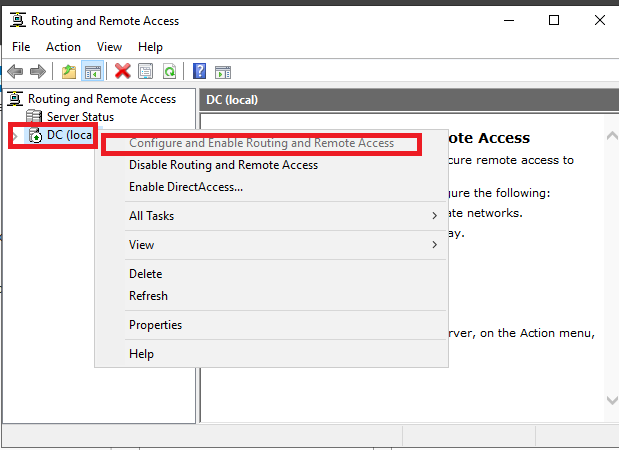
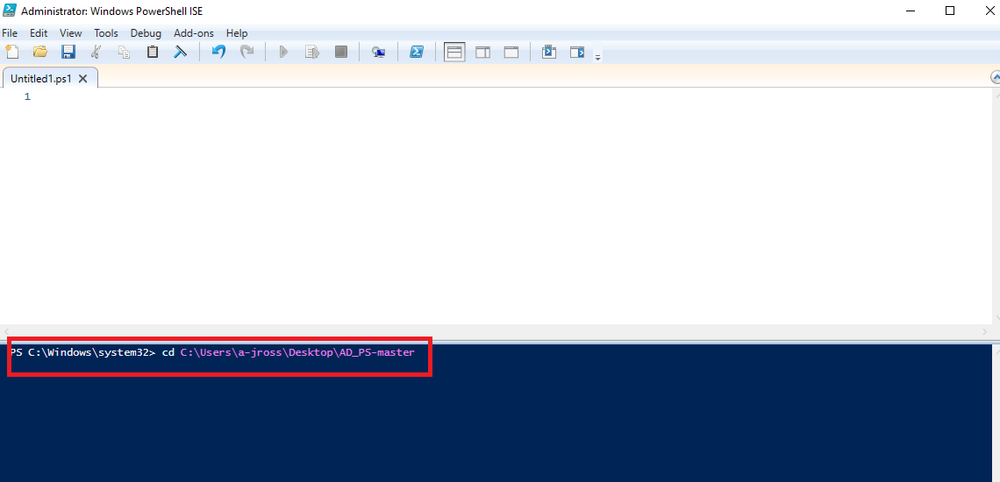
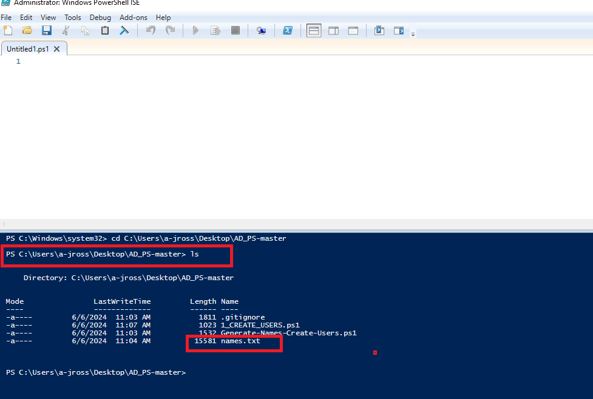
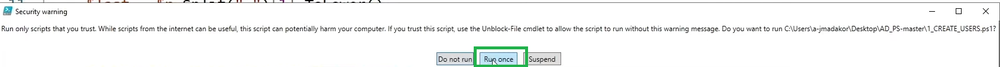
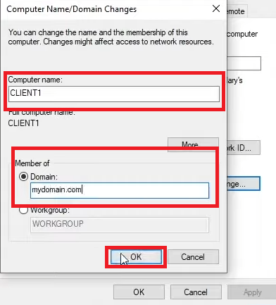

# ActiveDirectoryLab


<h2>Description</h2>
Project consists of a simple PowerShell script that walks the user through "zeroing out" (wiping) any drives that are connected to the system. The utility allows you to select the target disk and choose the number of passes that are performed. The PowerShell script will configure a diskpart script file based on the user's selections and then launch Diskpart to perform the disk sanitization.
<br />


<h2>Languages and Utilities Used</h2>

- <b>PowerShell</b> 
- <b></b>

<h2>Environments Used </h2>

- <b>Windows 10, Windows Server, VirtualBox</b> 

<h2>Program walk-through:</h2>

<p align="center">
Download VirtualBox: <br/>

<br />
<br />
Download Windows Server:  <br/>

<br />
<br />
Download Windows 10: <br/>

<br />
<br />
Create new Virtual Box: File + new  <br/>

<br />
<br />
Set up VirtualBox hardware & Harddisc, network and settings:  <br/>

 
  
  
<br />
<br />
Launch the VM to boot and select the ISO file from download folder  <br/>

<br />
<br />
 allow Windows server to boot than set up password   <br/>

<br />
<br />
 In the DC identify network adapters on the internal adapter assign the Ip adressing  <br/>


<br />
<br />
 Instal ADDS from Server Manager/ Add Roles <br/>

<br />
<br />
 Create domain Add new forest  <br/>

 
<br />
<br />
  After restart we now have an Admin account, from start menu select options to create a dedicated admin account <br/>


<br />
<br />
  Create an Orginizational unit under the new domnain with new user <br/>


<br />
<br />


<br />
<br />
Set up NAT configuration <br/>






<br />
<br />
Configure DHCP <br/>


Create users with powershell script  <br/>








</p>
Create Client computer  <br/>





<!--
 ```diff
- text in red
+ text in green
! text in orange
# text in gray
